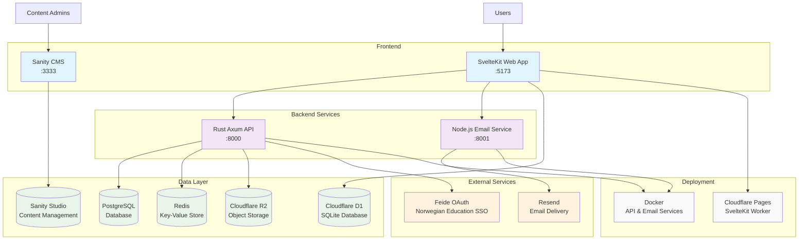

# Programmerbar Website

## Prerequisites

- [pnpm](https://pnpm.io/)
- [Node.js](https://nodejs.org/)

## How to run locally

1. Fill in env-variables

   ```bash
   cp programmerbar-web/.env.example .env
   ```

1. Fill in the empty variables

1. Install dependencies

   ```bash
   pnpm install
   ```

1. Apply migrations

   ```bash
   pnpm db:migrate:local
   ```

1. Start the development server

   ```bash
    pnpm dev
   ```

- Website will run on [http://localhost:5173](http://localhost:5173)
- Sanity will run on [http://localhost:3333](http://localhost:3333)
- API will run on [http://localhost:8000](http://localhost:8000)
- Email API will run on [http://localhost:8001](http://localhost:8001)

### Add invitation

To be able to login you need to create an invitation for yourself. You can do this by running the following command:

```bash
pnpm dlx tsx ./programmerbar-web/scripts/add-invitation.ts "<your-email>"
```

## Architecture

The architecture heavily relies on Cloudflare Pages and associated services like D1 and KV. The website is built with SvelteKit, and uses Sanity as a headless CMS.



### Key Components

- **SvelteKit Web App**: Main user interface with portal system for students and admin panel for board members
- **Rust Axum API**: High-performance backend handling authentication, user management, and business logic
- **Node.js Email Service**: Dedicated service for sending transactional emails via Resend
- **Sanity CMS**: Headless content management for products and general content
- **Cloudflare D1**: SQLite database used by the SvelteKit web application
- **PostgreSQL**: Primary database for the Rust API backend
- **Redis**: Key-value store for caching and session management
- **Cloudflare R2**: Object storage for file uploads and static assets
- **Feide OAuth**: Norwegian education federation for secure user authentication

### Deployment

- **SvelteKit Web App**: Deployed as a Cloudflare Worker via Cloudflare Pages with automatic deployments on `main` branch merges
- **Rust API & Email Service**: Containerized with Docker for flexible hosting
- **Database migrations**: Applied automatically to production databases during deployment

### Docker

See `programmerbar-api/Dockerfile` on how to build the Docker image.

To run the api with Docker use the following command:

```bash
docker run --env-file .env --network=host -p 8000:8000 programmerbar-api
```
